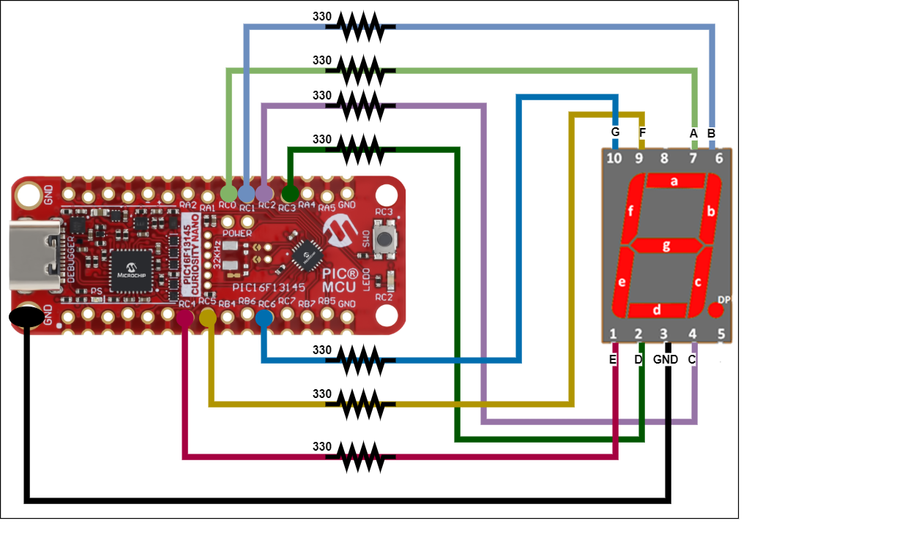
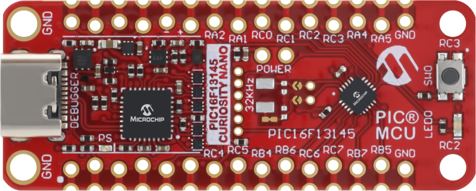
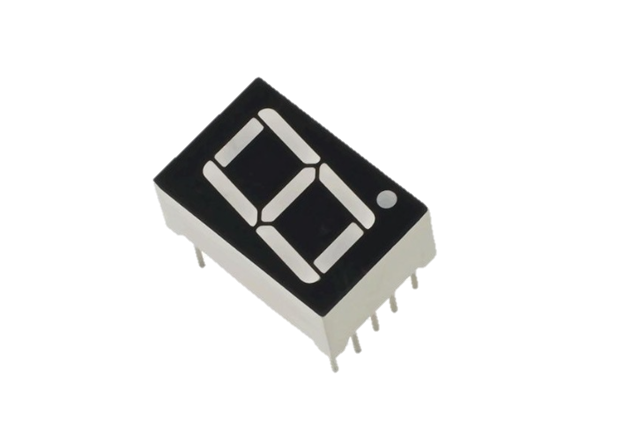
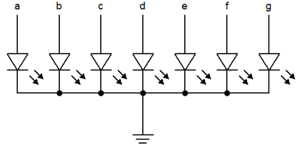
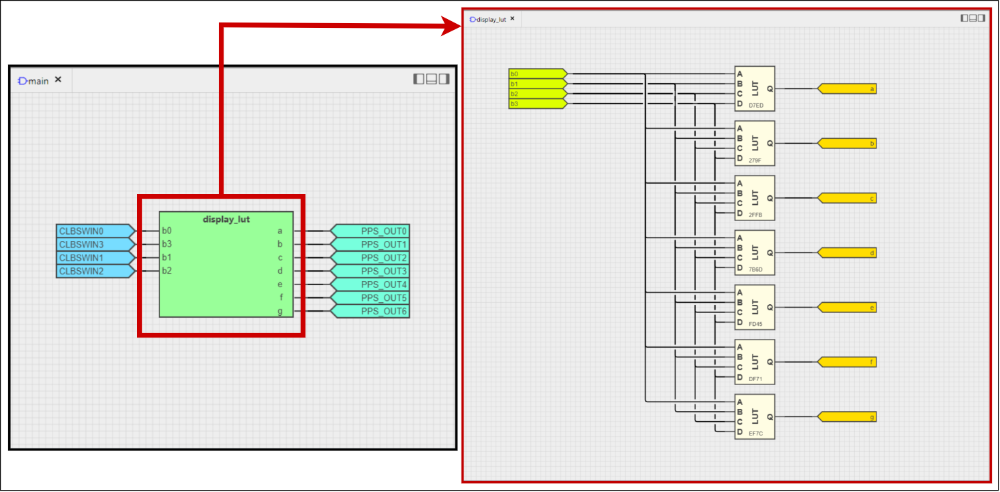
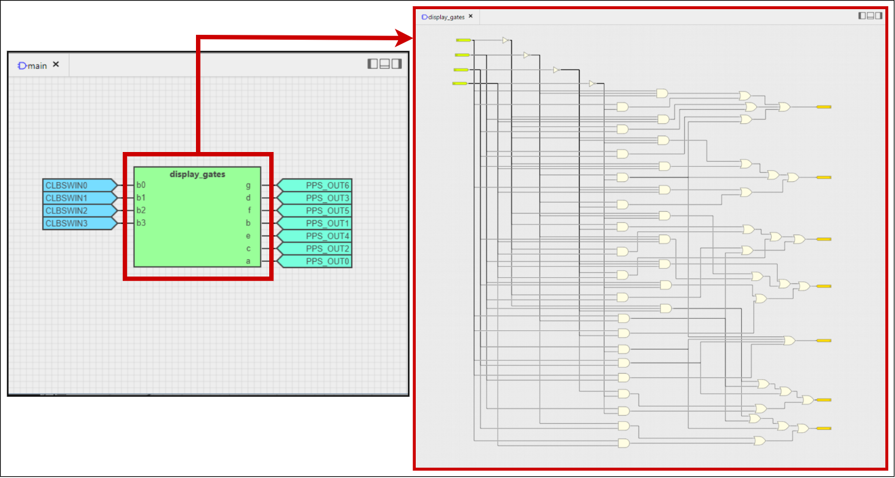
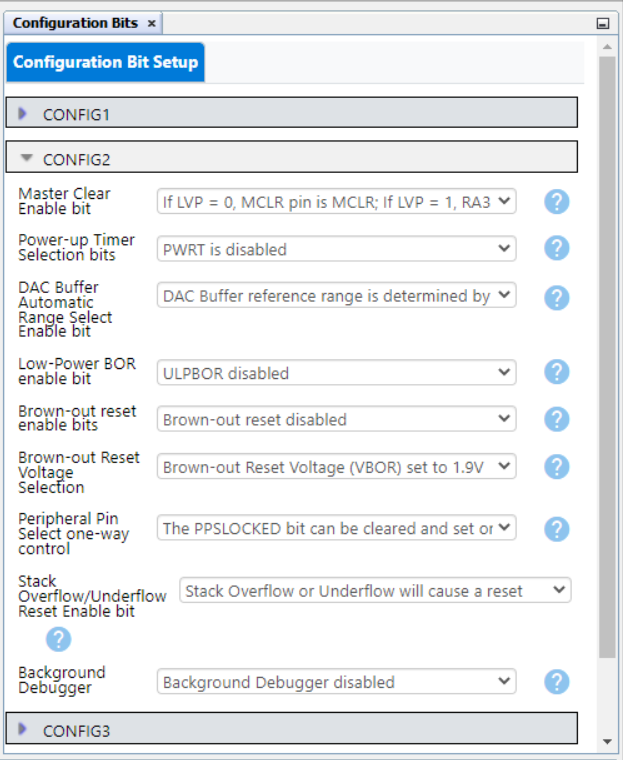
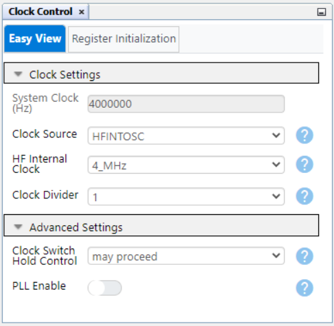
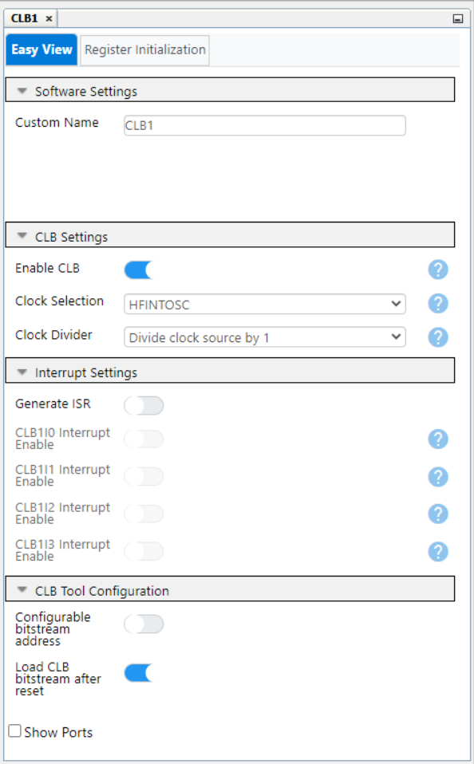
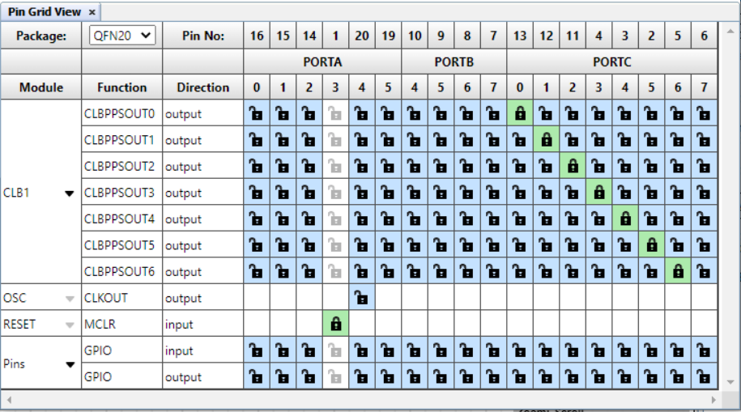

<!-- Please do not change this html logo with link -->

# 7-Segment Display Decoder — Use Cases for CLB Using the PIC16F13145 Microcontroller with MCC Melody

This repository provides two MPLAB® X projects for interfacing the Configurable Logic Block (CLB) and I/O Ports peripherals with a 7-segment display to show hexadecimal numbers:

- [7-Segment Display Decoder with LUTs](pic16f13145-7-segment-decoder-luts-mplab-mcc.X)
- [7-Segment Display Decoder with Logic Gates](pic16f13145-7-segment-decoder-gates-mplab-mcc.X)

 

The CLB peripheral is a collection of logic elements that can be programmed to perform a wide variety of digital logic functions. The logic function may be completely combinatorial, sequential, or a combination of the two, enabling users to incorporate hardware-based custom logic into their applications.

## Related Documentation

More details and code examples on the PIC16F13145 can be found at the following links:

- [PIC16F13145 Product Page](https://www.microchip.com/en-us/product/PIC16F13145?utm_source=GitHub&utm_medium=TextLink&utm_campaign=MCU8_MMTCha_PIC16F13145&utm_content=pic16f13145-7-segment-decoder-mplab-mcc&utm_bu=MCU08)
- [PIC16F13145 Code Examples on Discover](https://mplab-discover.microchip.com/v2?dsl=PIC16F13145)
- [PIC16F13145 Code Examples on GitHub](https://github.com/microchip-pic-avr-examples/?q=PIC16F13145)
- [7-Segment Display Datasheet](https://www.farnell.com/datasheets/1918247.pdf)

## Software Used

- [MPLAB X IDE v6.20 or newer](https://www.microchip.com/en-us/tools-resources/develop/mplab-x-ide?utm_source=GitHub&utm_medium=TextLink&utm_campaign=MCU8_MMTCha_PIC16F13145&utm_content=pic16f13145-7-segment-decoder-mplab-mcc&utm_bu=MCU08)
- [MPLAB XC8 v2.46 or newer](https://www.microchip.com/en-us/tools-resources/develop/mplab-xc-compilers?utm_source=GitHub&utm_medium=TextLink&utm_campaign=MCU8_MMTCha_PIC16F13145&utm_content=pic16f13145-7-segment-decoder-mplab-mcc&utm_bu=MCU08)
- [PIC16F1xxxx_DFP v1.25.389 or newer](https://packs.download.microchip.com/)

## Hardware Used

- The [PIC16F13145 Curiosity Nano Development board](https://www.microchip.com/en-us/development-tool/EV06M52A?utm_source=GitHub&utm_medium=TextLink&utm_campaign=MCU8_MMTCha_PIC16F13145&utm_content=pic16f13145-7-segment-decoder-mplab-mcc&utm_bu=MCU08) is used as a test platform:
   

- 7-Segment Display
   

- 7 x 330 Ohm Resistors

## Operation

To program the Curiosity Nano board with this MPLAB X project, follow the steps provided in the [How to Program the Curiosity Nano Board](#how-to-program-the-curiosity-nano-board) chapter.  

## Concept

This example demonstrates the capabilities of the CLB, a Core Independent Peripheral (CIP), that can control and manipulate the transmitted data through the I/O Ports for the Software Input Register of the CLB (CLBSWIN). This software register is incremented with 1 after each iteration, between 0 and 15, values that are displayed in hexadecimal on the display.

This application includes two different solutions through the CLB peripheral. The first application uses 7 different LUT embedded circuits for each pin of the display, and the second one uses only logic gates: AND, NOT, OR. Both implementations present the same result. The used display is Common Cathode, and in this type of display, all the cathode connections of the LED segments are connected together to logic `0` or ground. The separate segments are lightened by applying the logic `1` or HIGH signal through a current limiting resistor to forward bias the individual anode terminals `a` to `g`, as below.

 

The table below presents the truth table that correctly displays the hexadecimal number on a 7-segment display, depending on the input values.

|           |  **In**   |           |           |       |       |       | **Out** |       |       |       | **Displayed Number** |
| :-------: | :-------: | :-------: | :-------: | :---: | :---: | :---: | :-----: | :---: | :---: | :---: | :------------------: |
| **SWIN3** | **SWIN2** | **SWIN1** | **SWIN0** | **a** | **b** | **c** |  **d**  | **e** | **f** | **g** |                      |
|     0     |     0     |     0     |     0     |   1   |   1   |   1   |    1    |   1   |   1   |   0   |        **0**         |
|     0     |     0     |     0     |     1     |   0   |   1   |   1   |    0    |   0   |   0   |   0   |        **1**         |
|     0     |     0     |     1     |     0     |   1   |   1   |   0   |    1    |   1   |   0   |   1   |        **2**         |
|     0     |     0     |     1     |     1     |   1   |   1   |   1   |    1    |   0   |   0   |   1   |        **3**         |
|     0     |     1     |     0     |     0     |   0   |   1   |   1   |    0    |   0   |   1   |   1   |        **4**         |
|     0     |     1     |     0     |     1     |   1   |   0   |   1   |    1    |   1   |   1   |   1   |        **5**         |
|     0     |     1     |     1     |     0     |   1   |   0   |   1   |    1    |   1   |   1   |   1   |        **6**         |
|     0     |     1     |     1     |     1     |   1   |   1   |   1   |    0    |   0   |   0   |   0   |        **7**         |
|     1     |     0     |     0     |     0     |   1   |   1   |   1   |    1    |   1   |   1   |   1   |        **8**         |
|     1     |     0     |     0     |     1     |   1   |   1   |   1   |    1    |   0   |   1   |   1   |        **9**         |
|     1     |     0     |     1     |     0     |   1   |   1   |   1   |    0    |   1   |   1   |   1   |        **A**         |
|     1     |     0     |     1     |     1     |   0   |   0   |   1   |    1    |   1   |   1   |   1   |        **b**         |
|     1     |     1     |     0     |     0     |   1   |   0   |   0   |    1    |   1   |   1   |   0   |        **c**         |
|     1     |     1     |     0     |     1     |   0   |   1   |   1   |    1    |   1   |   0   |   1   |        **d**         |
|     1     |     1     |     1     |     0     |   1   |   0   |   0   |    1    |   1   |   1   |   1   |        **E**         |
|     1     |     1     |     1     |     1     |   1   |   0   |   0   |    0    |   1   |   1   |   1   |        **F**         |

  Both projects implement the logic of the 7-segment decoder using the CLB peripheral, but in two different manners. The main idea of the application is to display all the hexadecimal values on a 7-segment display, using software data from the main project interfaced with the CLB.

  The first project is described by 7 LUTs circuits as in the figure below. Each LUT is corresponding to one of the inputs of the 7-segment display, called from `a` to `f`, and its value is `1` or `0`, according to the table above.

 

The second project is defined by the CLB that configures only logic gates (NOT, AND, OR) and presents a higher complexity than the first project. Each final output of the logic gates is corresponding to one of the inputs of the 7-segment display, called from `a` to `f`, and its value is `1` or `0`, according to the table above.

 

## Setup

The following peripheral and clock configurations are set up using MPLAB Code Configurator (MCC) Melody for the PIC16F13145:

1. Configurations Bits:

   - CONFIG1:
     - External Oscillator mode selection bits: Oscillator not enabled
     - Power-up default value for COSC bits: HFINTOSC (1MHz)
        
   - CONFIG2:
     - Brown-out reset enable bits: Brown-out reset disabled
        
   - CONFIG3:
     - WDT operating mode: WDT Disabled, SEN is ignored
        

2. Clock Control:

   - Clock Source: HFINTOSC
   - HF Internal Clock: 4_MHz
   - Clock Divider: 1
      

3. CLB1:

   - Enable CLB: Enabled
   - Clock Selection: HFINTOSC
   - Clock Divider: Divide clock source by 4
      

4. CRC:

   - Auto-configured by CLB

5. NVM:

   - Auto-configured by CLB

6. Pin Grid View:
   - CLBPPSOUT0: RC0 (Signal to "a" pin of the display)
   - CLBPPSOUT1: RC1 (Signal to "b" pin of the display)
   - CLBPPSOUT2: RC2 (Signal to "c" pin of the display)
   - CLBPPSOUT3: RC3 (Signal to "d" pin of the display)
   - CLBPPSOUT4: RC4 (Signal to "e" pin of the display)
   - CLBPPSOUT5: RC5 (Signal to "f" pin of the display)
   - CLBPPSOUT6: RC6 (Signal to "g" pin of the display)
      

 

## Demo

The demo below presents the incrementing numbers in hexadecimal between 0 and 0xF (hexadecimal values) that are shown on the 7-segment display. The 330 Ohm resistors are needed for current limiting between each LED and I/O pins of the microcontroller.

 

**Note:** The demo is at 2x speed.

 

## Summary

This example demonstrates the capabilities of the CLB, a CIP that can manipulate the data from the software, while also displaying it in a 7-segment LED view.

 

## How to Program the Curiosity Nano Board

This chapter demonstrates how to use the MPLAB X IDE to program a PIC® device with an Example_Project.X. This is applicable to other projects.

1.  Connect the board to the PC.

2.  Open the Example_Project.X project in MPLAB X IDE.

3.  Set the Example_Project.X project as main project.
     Right click the project in the **Projects** tab and click **Set as Main Project**.
     

4.  Clean and build the Example_Project.X project.
     Right click the **Example_Project.X** project and select **Clean and Build**.
     

5.  Select **PICxxxxx Curiosity Nano** in the Connected Hardware Tool section of the project settings:
     Right click the project and click **Properties**.
     Click the arrow under the Connected Hardware Tool.
     Select **PICxxxxx Curiosity Nano** (click the **SN**), click **Apply** and then click **OK**:
     

6.  Program the project to the board.
     Right click the project and click **Make and Program Device**.
     

 

---

## Menu

- [Back to Top](#7-segment-display-decoder--use-cases-for-clb-using-the-pic16f13145-microcontroller-with-mcc-melody)
- [Back to Related Documentation](#related-documentation)
- [Back to Software Used](#software-used)
- [Back to Hardware Used](#hardware-used)
- [Back to Operation](#operation)
- [Back to Concept](#concept)
- [Back to Setup](#setup)
- [Back to Demo](#demo)
- [Back to Summary](#summary)
- [Back to How to Program the Curiosity Nano Board](#how-to-program-the-curiosity-nano-board)
